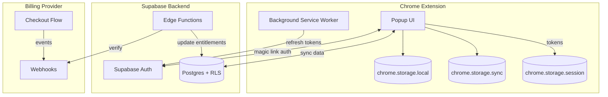
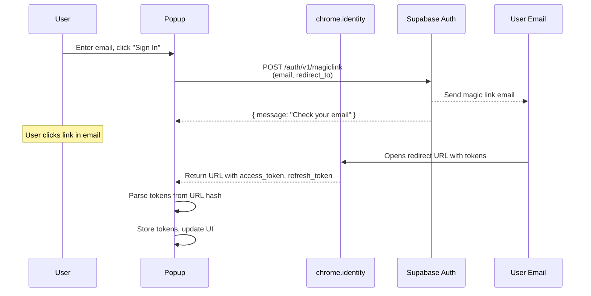
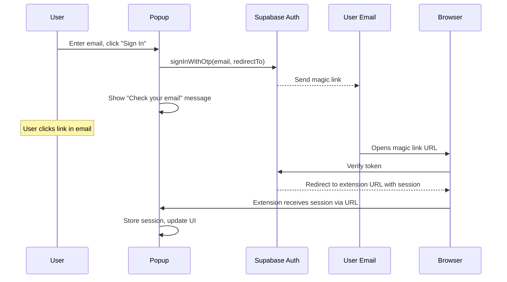
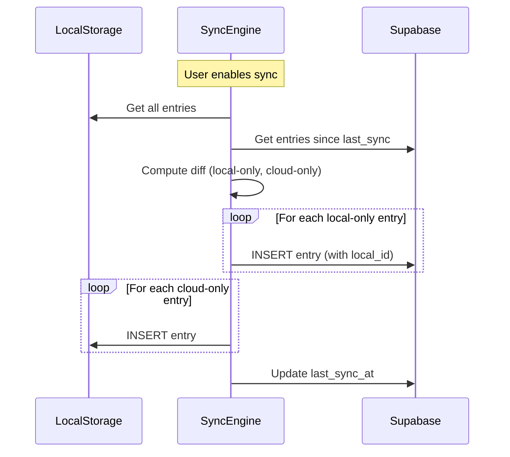

# 🔐 Premium & Authentication System

> Technical specification for optional sign-in, cloud sync, and premium features in Ext & Flex.

---

## Table of Contents

1. [Overview](#overview)
2. [Product Tiers](#product-tiers)
3. [Resources Required Before Building](#resources-required-before-building)
4. [Architecture Overview](#architecture-overview)
5. [Authentication Flow (MV3)](#authentication-flow-mv3)
6. [Data Storage Model](#data-storage-model)
7. [Supabase Schema & RLS](#supabase-schema--rls)
8. [Premium Entitlements](#premium-entitlements)
9. [Feature Gating Rules](#feature-gating-rules)
10. [Local-First Sync Algorithm](#local-first-sync-algorithm)
11. [Implementation Plan](#implementation-plan)
12. [Security Considerations](#security-considerations)
13. [Milestones](#milestones)

---

## Overview

### Goals

- Keep the extension **fully usable without sign-in** (current local-first behavior remains default)
- Add **optional sign-in** that enables cloud features (sync/backup, cross-device, etc.)
- Add a **premium entitlement layer** to unlock paid features and protect premium-only server resources
- Stay within **Chrome Manifest V3** constraints and follow best-practice security for a public client

### How to use this doc

This is a living implementation spec. As we complete work, we keep this file up to date by checking off items and adjusting steps so the current state is always reflected here.

### Non-Goals (for now)

- No mandatory accounts
- No collecting analytics/telemetry by default
- No "client-only DRM" — premium gating must be enforced server-side for premium data and services

---

## Product Tiers

### Free (Anonymous / Local-Only)

Everything that exists today:

- All workout data stored only in `chrome.storage.local` / `chrome.storage.sync`
- Full exercise library and progression system
- Streak tracking and achievements
- Reminders and notifications
- Theme customization

### Signed-In (Free Account)

All free features plus:

- **Cloud backup & restore** — never lose your data
- **Cross-device sync** — seamless experience across computers
- **Profile** — display name and avatar
- **Future: Social features** — sharing workouts, leaderboards (optional)

### Premium (Paid Subscription)

All signed-in features plus:

- **Advanced analytics** — server-computed insights, trends, predictions
- **Program library** — curated workout programs
- **Extended history retention** — unlimited cloud history (vs. limited for free)
- **Priority support**
- **Future: Team features** — shared workouts, challenges
- **Future: Custom exercises** — create and sync custom exercises

> **Principle**: Any feature that costs ongoing backend resources (compute, storage, bandwidth) should be premium.

---

## Resources Required Before Building

### 1. Supabase Project

- [ ] Create a Supabase project for production
- [ ] (Optional) Create a separate project or branch for development
- [ ] Collect the following credentials:

| Credential | Visibility | Where to Use |
|------------|------------|--------------|
| **Project URL** | Public | Extension code |
| **Anon/public key** | Public | Extension code |
| **Service role key** | **SECRET** | Server-side only (Edge Functions, webhooks) |

- [ ] Enable Auth and configure email provider:
  - Email magic link (passwordless, lowest friction)
  - Configure email templates in Supabase dashboard
  - Set appropriate rate limits for magic link requests

### 2. Chrome Extension Identity

If you’re eventually publishing on the Chrome Web Store, the simplest rule is this:

- **The Web Store listing gives you a stable ID automatically**. Everyone who installs from the store will get the same extension ID, and updates keep that ID.

What usually bites people is **dev vs prod IDs**, so here are the best options.

#### Best practice for the Web Store path

##### Option A (recommended): accept a different ID in dev

- Keep your dev install as unpacked with whatever ID Chrome assigns
- Once you upload to the Web Store, the store ID becomes the 'real' one
- If your extension talks to a backend, don’t hardcode the extension ID as an auth mechanism. Use OAuth, tokens, or a device install token
- This is the least risky approach because you don’t have to manage keys

##### Option B: force your dev ID to match the future Web Store ID

Only do this if you truly need it (web accessible resources, OAuth redirect allowlists, backend allowlists, native messaging allowlists, etc.)

How:

- Create a keypair once (pack extension) and keep the `.pem`
- Put the derived key into `manifest.json` so unpacked installs use the same ID
- Use that same key when you build for store so the store ID matches

But there’s a catch:

- If you upload to the Web Store without controlling the key, the store can end up using a different one, giving you a different ID than your dev one
- So if you choose this route, treat the `.pem` as critical, and keep it stable

##### What I’d do for you (practical)

- If your only goal is 'same ID for everyone eventually', just publish via Web Store and you’re done
- If you need to preconfigure allowlists before launch, use Option B now, and keep the `.pem` safe

Quick check: do you actually need the ID to be stable pre-launch

You probably only need it stable if you’re doing one of these:

- Backend allowlisting by `chrome.runtime.id`
- OAuth client redirect allowlist tied to extension ID
- Native messaging host allowlist
- Enterprise policy deployment configs

If none of those apply, go with Option A and don’t fight IDs yet

#### Magic link redirects (MV3)

For `chrome.identity.launchWebAuthFlow` to work with magic links, you must allow the extension redirect URL:

- `https://<extension-id>.chromiumapp.org/`

In practice, you may need to add **both** dev and prod redirect URLs to Supabase allowed redirects during development, or use Option B if you need one stable ID before launch.

#### Checklist (work through this one by one)

- [ ] Decide if you need a stable extension ID pre-launch (see quick check list above)
- [ ] Pick an approach: Option A (different dev ID) or Option B (pinned dev ID)
- [ ] Record your current dev extension ID (unpacked)
- [ ] Add allowed redirect URL(s) to Supabase Auth settings:
  - [ ] Dev redirect: `https://<dev-extension-id>.chromiumapp.org/`
  - [ ] Prod redirect: `https://<prod-extension-id>.chromiumapp.org/` (once you have it)
- [ ] Confirm magic link sign-in works end-to-end using `chrome.identity.launchWebAuthFlow`
- [ ] If using Option B, securely store the `.pem` and document where it lives
- [ ] After first Web Store upload, record the production extension ID and confirm it matches expectations
- [ ] Re-check any allowlists that depend on extension ID (Supabase redirects, backend allowlists, native messaging, enterprise policy configs)

#### Walkthrough

##### Walkthrough for Option A (recommended)

- Install as unpacked during development and accept whatever ID Chrome assigns
- Configure Supabase allowed redirects to include the dev redirect URL
- Build auth and sync using proper tokens and sessions, not `chrome.runtime.id` as an auth mechanism
- When you publish to the Web Store, the production extension ID becomes stable automatically
- Add the production redirect URL to Supabase allowed redirects
- Keep both dev and prod redirects during development, then remove dev redirects later if you want to tighten config

##### Walkthrough for Option B (pin dev to the future store ID)

Only do this if you truly need one stable ID before launch.

- Create the keypair once by packing the extension and keep the `.pem` safe
- Add the derived `key` field to `public/manifest.json` so unpacked installs use the pinned ID
- Make sure your store build uses the same keypair so the Web Store ID matches your pinned dev ID
- Treat the `.pem` as critical (backup it, restrict access, and avoid regenerating it)
- Verify the ID after Web Store upload and re-check all allowlists that depend on it

### 3. Billing Provider (Later)

Provider-agnostic design, but likely Stripe:

- [ ] Create billing provider account
- [ ] Configure products/prices for premium tier
- [ ] Set up webhook endpoint (Supabase Edge Function recommended)
- [ ] Store webhook signing secret in Supabase secrets

---

## Architecture Overview



### Data Flow Principles

1. **Local-first**: `chrome.storage.local` is always the source of truth for workout data
2. **Optional sync**: When signed in with sync enabled, data is mirrored to Supabase
3. **Server-enforced premium**: Premium features that touch the server are gated by RLS/RPC
4. **Offline resilient**: The extension works fully offline; sync happens when connectivity returns

---

## Authentication Flow (MV3)

### Constraints

- Extension is a **public client** — all code is inspectable
- **No secrets** can be kept in the extension bundle
- Use only **publishable** config (Supabase URL + anon key)
- MV3 service workers can be terminated at any time

### Why Email Magic Links?

| Benefit | Description |
|---------|-------------|
| **No OAuth setup** | Skip Google Cloud Console, OAuth consent screens, and client credentials |
| **Passwordless** | Users don't need to create/remember another password |
| **Simple UX** | Enter email → click link → done |
| **Lower friction** | No "Sign in with Google" permission prompts |
| **Privacy-friendly** | No third-party OAuth provider involved |
| **Reliable** | No dependency on external OAuth providers being available |

### Recommended Flow: Email Magic Link with `chrome.identity.launchWebAuthFlow`

Magic links are the simplest and most secure passwordless auth method. No third-party OAuth providers needed.



**Alternative: In-Extension Magic Link Flow**

For a smoother UX, the extension can listen for the magic link callback:



### Implementation Details

#### 1. Supabase Client Setup

```typescript
// src/lib/supabase/client.ts
import { createClient } from '@supabase/supabase-js'

const SUPABASE_URL = 'https://<project>.supabase.co'
const SUPABASE_ANON_KEY = '<your-anon-key>'

export const supabase = createClient(SUPABASE_URL, SUPABASE_ANON_KEY, {
  auth: {
    autoRefreshToken: true,
    persistSession: false, // We manage session storage ourselves
    detectSessionInUrl: false, // We handle URL parsing manually
  }
})
```

#### 2. Send Magic Link

```typescript
// src/lib/supabase/auth.ts
const REDIRECT_URL = chrome.identity.getRedirectURL()

export async function sendMagicLink(email: string): Promise<void> {
  const { error } = await supabase.auth.signInWithOtp({
    email,
    options: {
      emailRedirectTo: REDIRECT_URL,
    }
  })

  if (error) {
    throw new Error(`Failed to send magic link: ${error.message}`)
  }
}
```

#### 3. Handle Magic Link Callback

When the user clicks the magic link, they're redirected to your extension URL with tokens in the hash:

```typescript
// Listen for the magic link callback
export async function handleMagicLinkCallback(): Promise<Session | null> {
  return new Promise((resolve, reject) => {
    // Use launchWebAuthFlow to capture the redirect
    chrome.identity.launchWebAuthFlow(
      {
        url: buildMagicLinkListenerUrl(),
        interactive: false, // Non-interactive, just waiting for redirect
      },
      (redirectUrl) => {
        if (chrome.runtime.lastError || !redirectUrl) {
          resolve(null)
          return
        }

        const session = parseSessionFromUrl(redirectUrl)
        resolve(session)
      }
    )
  })
}

function parseSessionFromUrl(url: string): Session | null {
  const hashParams = new URLSearchParams(url.split('#')[1])

  const accessToken = hashParams.get('access_token')
  const refreshToken = hashParams.get('refresh_token')
  const expiresIn = hashParams.get('expires_in')

  if (!accessToken || !refreshToken) {
    return null
  }

  return {
    access_token: accessToken,
    refresh_token: refreshToken,
    expires_at: Math.floor(Date.now() / 1000) + parseInt(expiresIn || '3600'),
  }
}
```

#### 4. Complete Sign-In Flow

```typescript
// src/lib/supabase/auth.ts
export async function signInWithEmail(email: string): Promise<{ needsConfirmation: boolean }> {
  // Send the magic link
  await sendMagicLink(email)

  return { needsConfirmation: true }
}

// Called when user returns from clicking the magic link
export async function completeSignIn(url: string): Promise<Session> {
  const session = parseSessionFromUrl(url)

  if (!session) {
    throw new Error('Invalid magic link callback')
  }

  // Set the session in Supabase client
  await supabase.auth.setSession({
    access_token: session.access_token,
    refresh_token: session.refresh_token,
  })

  // Store in chrome.storage
  await storeSession(session)

  return session
}
```

#### 5. Sign Out

```typescript
export async function signOut(): Promise<void> {
  await supabase.auth.signOut()
  await chrome.storage.session.remove(['auth_session'])
  await chrome.storage.local.remove(['auth_refresh_token', 'auth_remember_me'])
}
```

### Session Storage Strategy

| Storage Area | Contents | Lifetime | Security |
|--------------|----------|----------|----------|
| `chrome.storage.session` | Access token, refresh token | Browser session | Clears on browser close |
| `chrome.storage.local` | Refresh token (opt-in "Remember me") | Persistent | User must opt-in with warning |
| In-memory | Access token | Tab/popup lifetime | Most secure, least persistent |

#### Default Behavior (Secure)

```typescript
// Store in session storage (clears on browser close)
async function storeSession(session: Session): Promise<void> {
  await chrome.storage.session.set({
    auth_session: {
      access_token: session.access_token,
      refresh_token: session.refresh_token,
      expires_at: session.expires_at,
    }
  })
}
```

#### "Remember Me" Option (User Opt-In)

```typescript
// Store refresh token persistently (with user consent)
async function enableRememberMe(refreshToken: string): Promise<void> {
  await chrome.storage.local.set({
    auth_refresh_token: refreshToken,
    auth_remember_me: true,
  })
}
```

### Token Refresh Strategy

```typescript
// In background service worker
chrome.alarms.create('refresh-auth', { periodInMinutes: 5 })

chrome.alarms.onAlarm.addListener(async (alarm) => {
  if (alarm.name === 'refresh-auth') {
    const session = await getStoredSession()
    if (session && isExpiringSoon(session.expires_at)) {
      const { data, error } = await supabase.auth.refreshSession({
        refresh_token: session.refresh_token,
      })
      if (data.session) {
        await storeSession(data.session)
      }
    }
  }
})
```

---

## Data Storage Model

### Local Data (Existing — No Changes)

| Data | Storage Area | Purpose |
|------|--------------|---------|
| Exercise entries | `chrome.storage.local` | Workout history |
| Progression state | `chrome.storage.local` | XP, levels, unlocks |
| Streak data | `chrome.storage.local` | Consecutive days |
| User preferences | `chrome.storage.sync` | Settings (synced by Chrome) |

### Cloud Data (New — Signed-In Users)

#### `profiles` Table

```sql
create table profiles (
  id uuid primary key references auth.users(id) on delete cascade,
  display_name text,
  avatar_url text,
  created_at timestamptz default now(),
  updated_at timestamptz default now()
)
```

#### `exercise_entries` Table

```sql
create table exercise_entries (
  id uuid primary key default gen_random_uuid(),
  user_id uuid not null references auth.users(id) on delete cascade,
  local_id text not null, -- matches chrome.storage ID for de-dup
  exercise_id text not null,
  value integer not null,
  timestamp timestamptz not null,
  session_id text,
  synced_at timestamptz default now(),

  unique(user_id, local_id)
)
```

#### `user_progression` Table

```sql
create table user_progression (
  user_id uuid primary key references auth.users(id) on delete cascade,
  total_xp integer default 0,
  level integer default 1,
  unlocked_exercises text[] default '{}',
  achievements text[] default '{}',
  updated_at timestamptz default now()
)
```

#### `sync_metadata` Table

```sql
create table sync_metadata (
  user_id uuid primary key references auth.users(id) on delete cascade,
  last_sync_at timestamptz,
  device_id text,
  sync_enabled boolean default false
)
```

---

## Supabase Schema & RLS

### Enable RLS on All Tables

```sql
alter table profiles enable row level security;
alter table exercise_entries enable row level security;
alter table user_progression enable row level security;
alter table sync_metadata enable row level security;
alter table entitlements enable row level security;
```

### Standard User Policies

```sql
-- profiles: users can read/update their own profile
create policy "Users can view own profile"
  on profiles for select
  using (auth.uid() = id);

create policy "Users can update own profile"
  on profiles for update
  using (auth.uid() = id);

-- exercise_entries: users can CRUD their own entries
create policy "Users can view own entries"
  on exercise_entries for select
  using (auth.uid() = user_id);

create policy "Users can insert own entries"
  on exercise_entries for insert
  with check (auth.uid() = user_id);

create policy "Users can delete own entries"
  on exercise_entries for delete
  using (auth.uid() = user_id);

-- user_progression: users can read/update their own progression
create policy "Users can view own progression"
  on user_progression for select
  using (auth.uid() = user_id);

create policy "Users can update own progression"
  on user_progression for update
  using (auth.uid() = user_id);
```

### Premium-Gated Policies

For tables/features that require premium:

```sql
-- Helper function to check premium status
create or replace function is_premium()
returns boolean as $$
  select exists (
    select 1 from entitlements
    where user_id = auth.uid()
      and status = 'active'
      and current_period_end > now()
  );
$$ language sql security definer;

-- Example: premium_analytics table only accessible to premium users
create policy "Premium users can view analytics"
  on premium_analytics for select
  using (auth.uid() = user_id and is_premium());
```

### Auto-Create Profile on Sign-Up

```sql
create or replace function handle_new_user()
returns trigger as $$
begin
  -- For magic link users, display_name defaults to email prefix
  -- Users can update their display name later
  insert into profiles (id, display_name)
  values (
    new.id,
    coalesce(
      new.raw_user_meta_data->>'name',
      split_part(new.email, '@', 1)
    )
  );

  insert into user_progression (user_id)
  values (new.id);

  insert into sync_metadata (user_id)
  values (new.id);

  return new;
end;
$$ language plpgsql security definer;

create trigger on_auth_user_created
  after insert on auth.users
  for each row execute function handle_new_user();
```

---

## Premium Entitlements

### Entitlements Table

```sql
create table entitlements (
  user_id uuid primary key references auth.users(id) on delete cascade,
  plan text not null default 'free', -- 'free', 'premium', 'premium_annual'
  status text not null default 'inactive', -- 'active', 'inactive', 'canceled', 'past_due'
  current_period_start timestamptz,
  current_period_end timestamptz,
  cancel_at_period_end boolean default false,
  provider text, -- 'stripe', 'paddle', etc.
  provider_customer_id text,
  provider_subscription_id text,
  updated_at timestamptz default now()
);

-- Users can only read their own entitlements (never write)
create policy "Users can view own entitlements"
  on entitlements for select
  using (auth.uid() = user_id);
```

### Billing Events (Audit Trail)

```sql
create table billing_events (
  id uuid primary key default gen_random_uuid(),
  user_id uuid references auth.users(id) on delete set null,
  provider text not null,
  event_type text not null,
  event_id text, -- provider's event ID for idempotency
  raw_payload jsonb,
  processed_at timestamptz default now(),

  unique(provider, event_id)
);

-- Only service role can write billing events
-- No RLS policy for users (they can't access this table)
```

### Webhook Handler (Edge Function)

```typescript
// supabase/functions/billing-webhook/index.ts
import { serve } from 'https://deno.land/std@0.168.0/http/server.ts'
import { createClient } from 'https://esm.sh/@supabase/supabase-js@2'
import Stripe from 'https://esm.sh/stripe@12'

const stripe = new Stripe(Deno.env.get('STRIPE_SECRET_KEY')!, {
  apiVersion: '2023-10-16',
})

const supabase = createClient(
  Deno.env.get('SUPABASE_URL')!,
  Deno.env.get('SUPABASE_SERVICE_ROLE_KEY')!
)

serve(async (req) => {
  const signature = req.headers.get('stripe-signature')!
  const body = await req.text()

  let event: Stripe.Event
  try {
    event = stripe.webhooks.constructEvent(
      body,
      signature,
      Deno.env.get('STRIPE_WEBHOOK_SECRET')!
    )
  } catch (err) {
    return new Response('Webhook signature verification failed', { status: 400 })
  }

  // Log the event
  await supabase.from('billing_events').insert({
    provider: 'stripe',
    event_type: event.type,
    event_id: event.id,
    raw_payload: event,
  })

  // Handle subscription events
  if (event.type === 'customer.subscription.created' ||
      event.type === 'customer.subscription.updated') {
    const subscription = event.data.object as Stripe.Subscription
    const userId = subscription.metadata.user_id

    await supabase.from('entitlements').upsert({
      user_id: userId,
      plan: subscription.items.data[0].price.lookup_key || 'premium',
      status: subscription.status === 'active' ? 'active' : 'inactive',
      current_period_start: new Date(subscription.current_period_start * 1000).toISOString(),
      current_period_end: new Date(subscription.current_period_end * 1000).toISOString(),
      cancel_at_period_end: subscription.cancel_at_period_end,
      provider: 'stripe',
      provider_customer_id: subscription.customer as string,
      provider_subscription_id: subscription.id,
      updated_at: new Date().toISOString(),
    })
  }

  if (event.type === 'customer.subscription.deleted') {
    const subscription = event.data.object as Stripe.Subscription
    const userId = subscription.metadata.user_id

    await supabase.from('entitlements').update({
      status: 'inactive',
      updated_at: new Date().toISOString(),
    }).eq('user_id', userId)
  }

  return new Response(JSON.stringify({ received: true }), {
    headers: { 'Content-Type': 'application/json' },
  })
})
```

---

## Feature Gating Rules

### Gating Boundaries

| Feature Type | Gating Location | Enforcement |
|--------------|-----------------|-------------|
| UI-only (cosmetic) | Client | Soft gate (can be bypassed) |
| Local data features | Client | Soft gate |
| Cloud data (free tier) | Server (RLS) | Hard gate |
| Cloud data (premium) | Server (RLS + entitlement check) | Hard gate |
| Server compute | Server (Edge Function) | Hard gate |

### Client-Side Gating (UI)

```typescript
// src/lib/hooks/useAuth.ts
export function useAuth() {
  const [session, setSession] = useState<Session | null>(null)
  const [entitlements, setEntitlements] = useState<Entitlements | null>(null)

  const isSignedIn = session !== null
  const isPremium = entitlements?.status === 'active'

  return { session, isSignedIn, isPremium, entitlements }
}

// Usage in components
function PremiumFeature() {
  const { isPremium } = useAuth()

  if (!isPremium) {
    return <UpgradePrompt />
  }

  return <ActualFeature />
}
```

### Entitlements Cache Strategy

```typescript
interface EntitlementsCache {
  data: Entitlements
  fetchedAt: number
}

const CACHE_TTL_MS = 5 * 60 * 1000 // 5 minutes

async function getEntitlements(forceRefresh = false): Promise<Entitlements> {
  const cached = await chrome.storage.session.get('entitlements_cache')

  if (!forceRefresh && cached.entitlements_cache) {
    const { data, fetchedAt } = cached.entitlements_cache as EntitlementsCache
    if (Date.now() - fetchedAt < CACHE_TTL_MS) {
      return data
    }
  }

  // Fetch fresh from server
  const { data, error } = await supabase
    .from('entitlements')
    .select('*')
    .single()

  if (error) throw error

  // Cache the result
  await chrome.storage.session.set({
    entitlements_cache: {
      data,
      fetchedAt: Date.now(),
    }
  })

  return data
}
```

### Server-Side Gating (RLS)

Premium features that touch the server **must** be gated by RLS:

```sql
-- This policy ensures even if client code is modified,
-- users cannot access premium data without active entitlement
create policy "Premium users only"
  on premium_programs for select
  using (
    auth.uid() = user_id
    and exists (
      select 1 from entitlements
      where entitlements.user_id = auth.uid()
        and entitlements.status = 'active'
        and entitlements.current_period_end > now()
    )
  );
```

---

## Local-First Sync Algorithm

### Principles

1. **Local is always truth** — user can always work offline
2. **Append-only history** — exercise entries are never modified, only added
3. **Stable IDs** — local IDs are preserved to enable de-duplication
4. **Conflict-free** — append-only design means no conflicts
5. **User-controlled** — sync is opt-in and can be disabled

### Sync Flow



### Implementation

```typescript
// src/lib/sync/sync-engine.ts

interface SyncResult {
  uploaded: number
  downloaded: number
  errors: string[]
}

export async function syncExerciseEntries(): Promise<SyncResult> {
  const result: SyncResult = { uploaded: 0, downloaded: 0, errors: [] }

  try {
    // 1. Get local entries
    const localEntries = await exerciseStorage.getAllEntries()
    const localIds = new Set(localEntries.map(e => e.id))

    // 2. Get last sync timestamp
    const { data: syncMeta } = await supabase
      .from('sync_metadata')
      .select('last_sync_at')
      .single()

    const lastSync = syncMeta?.last_sync_at || '1970-01-01T00:00:00Z'

    // 3. Get cloud entries (all for initial sync, or since last sync)
    const { data: cloudEntries, error } = await supabase
      .from('exercise_entries')
      .select('*')
      .gte('synced_at', lastSync)

    if (error) throw error

    const cloudLocalIds = new Set(cloudEntries?.map(e => e.local_id) || [])

    // 4. Upload local-only entries
    const toUpload = localEntries.filter(e => !cloudLocalIds.has(e.id))

    if (toUpload.length > 0) {
      const { error: uploadError } = await supabase
        .from('exercise_entries')
        .upsert(
          toUpload.map(e => ({
            local_id: e.id,
            exercise_id: e.exerciseId,
            value: e.value,
            timestamp: new Date(e.timestamp).toISOString(),
            session_id: e.sessionId,
          })),
          { onConflict: 'user_id,local_id' }
        )

      if (uploadError) {
        result.errors.push(`Upload failed: ${uploadError.message}`)
      } else {
        result.uploaded = toUpload.length
      }
    }

    // 5. Download cloud-only entries
    const toDownload = cloudEntries?.filter(e => !localIds.has(e.local_id)) || []

    for (const entry of toDownload) {
      await exerciseStorage.importEntry({
        id: entry.local_id,
        exerciseId: entry.exercise_id,
        value: entry.value,
        timestamp: new Date(entry.timestamp).getTime(),
        sessionId: entry.session_id,
      })
      result.downloaded++
    }

    // 6. Update sync metadata
    await supabase
      .from('sync_metadata')
      .update({ last_sync_at: new Date().toISOString() })
      .eq('user_id', (await supabase.auth.getUser()).data.user?.id)

  } catch (err) {
    result.errors.push(`Sync failed: ${err instanceof Error ? err.message : 'Unknown error'}`)
  }

  return result
}
```

### Sync Triggers

```typescript
// Sync on these events:
// 1. User enables sync toggle
// 2. User signs in (if sync was previously enabled)
// 3. Every N minutes while signed in (background)
// 4. User manually triggers sync

// Background sync alarm
chrome.alarms.create('sync-data', { periodInMinutes: 15 })

chrome.alarms.onAlarm.addListener(async (alarm) => {
  if (alarm.name === 'sync-data') {
    const session = await getStoredSession()
    const syncEnabled = await isSyncEnabled()

    if (session && syncEnabled) {
      await syncExerciseEntries()
    }
  }
})
```

### Conflict Handling

Since exercise entries are append-only and identified by stable local IDs:

- **Same entry on both sides**: Skip (already synced)
- **Entry only local**: Upload to cloud
- **Entry only cloud**: Download to local
- **Progression data**: Use "last write wins" with timestamp comparison

```typescript
async function syncProgression(): Promise<void> {
  const localProgression = await progressionStorage.get()
  const { data: cloudProgression } = await supabase
    .from('user_progression')
    .select('*')
    .single()

  if (!cloudProgression) {
    // First sync — upload local
    await supabase.from('user_progression').upsert({
      total_xp: localProgression.totalXP,
      level: localProgression.level,
      unlocked_exercises: localProgression.unlockedExercises,
      achievements: localProgression.achievements,
    })
    return
  }

  // Compare timestamps, keep higher XP (can only go up)
  const useCloud = cloudProgression.total_xp > localProgression.totalXP
  const merged = useCloud ? cloudProgression : localProgression

  // Update both sides with merged data
  await progressionStorage.set(merged)
  await supabase.from('user_progression').upsert(merged)
}
```

---

## Implementation Plan

### New Files to Create

```
src/
├── features/
│   └── auth/
│       ├── components/
│       │   ├── SignInButton.tsx
│       │   ├── SignOutButton.tsx
│       │   ├── AccountSection.tsx
│       │   └── index.ts
│       ├── hooks/
│       │   ├── useAuth.ts
│       │   └── index.ts
│       └── index.ts
├── lib/
│   ├── supabase/
│   │   ├── client.ts          # Supabase client initialization
│   │   ├── auth.ts            # Auth helpers (signIn, signOut, etc.)
│   │   └── index.ts
│   ├── storage/
│   │   └── auth-storage.ts    # Session token storage
│   └── sync/
│       ├── sync-engine.ts     # Main sync logic
│       ├── conflict-resolver.ts
│       └── index.ts
├── stores/
│   └── AuthStore.tsx          # Auth context provider
└── types/
    └── auth.ts                # Auth-related types
```

### Files to Modify

- `src/features/settings/SettingsView.tsx` — Add Account section
- `src/app/App.tsx` — Wrap with AuthProvider
- `src/scripts/background/background.ts` — Add token refresh and sync alarms
- `public/manifest.json` — Add `identity` permission

### Manifest Changes

```json
{
  "permissions": [
    "storage",
    "alarms",
    "notifications",
    "idle",
    "identity"
  ]
}
```

> **Note**: No `oauth2` configuration needed for magic links! This simplifies setup significantly compared to Google OAuth.

---

## Security Considerations

### Public Client Constraints

- **Never ship secrets** — no service role keys, no API secrets in the extension
- **Assume code is readable** — all JavaScript can be inspected
- **Client-side gating is cosmetic** — real enforcement must be server-side

### Token Security

| Risk | Mitigation |
|------|------------|
| Token theft by malicious extension | Use `chrome.storage.session` (not accessible cross-extension) |
| Token theft by malware | Default to session-only storage; "Remember me" opt-in with warning |
| Token in transit | Always HTTPS; Supabase handles TLS |
| Token in logs | Never log tokens; use structured logging |

### Content Script Isolation

```typescript
// NEVER pass tokens to content scripts
// Auth operations should only happen in:
// - Popup (src/popup.tsx)
// - Background service worker (src/scripts/background/)

// If content script needs to trigger auth, use message passing:
chrome.runtime.sendMessage({ type: 'SIGN_IN' })
```

### RLS is the Security Boundary

```
┌─────────────────────────────────────────────────────────┐
│                    Client (Extension)                    │
│  ┌─────────────────────────────────────────────────┐   │
│  │              UI Gating (Cosmetic)                │   │
│  │  isPremium ? <Feature /> : <Upsell />           │   │
│  └─────────────────────────────────────────────────┘   │
└─────────────────────────────────────────────────────────┘
                           │
                           │ API calls with access_token
                           ▼
┌─────────────────────────────────────────────────────────┐
│                 Supabase (Server)                        │
│  ┌─────────────────────────────────────────────────┐   │
│  │         RLS Policies (Security Boundary)         │   │
│  │  auth.uid() = user_id AND is_premium()          │   │
│  └─────────────────────────────────────────────────┘   │
│                                                         │
│  Even if client code is modified, RLS blocks access    │
└─────────────────────────────────────────────────────────┘
```

---

## Milestones

### M1: Optional Sign-In + Session Management

- [ ] Supabase client setup
- [ ] Email magic link auth flow implementation
- [ ] Session storage (session + optional local)
- [ ] Token refresh in background
- [ ] Sign in / Sign out UI in Settings
- [ ] Profile display (with editable display name)

### M2: Cloud Backup & Sync

- [ ] Database schema + RLS policies
- [ ] Sync engine (upload/download)
- [ ] Sync toggle in Settings
- [ ] Background sync with alarms
- [ ] Sync status indicator
- [ ] Manual sync trigger

### M3: Premium Entitlements

- [ ] Entitlements table + RLS
- [ ] Billing webhook Edge Function
- [ ] Entitlements cache in extension
- [ ] Premium feature gating (UI + server)
- [ ] Upgrade flow (link to billing portal)
- [ ] One premium-only feature (e.g., advanced analytics)

---

*Last updated: December 2024*
