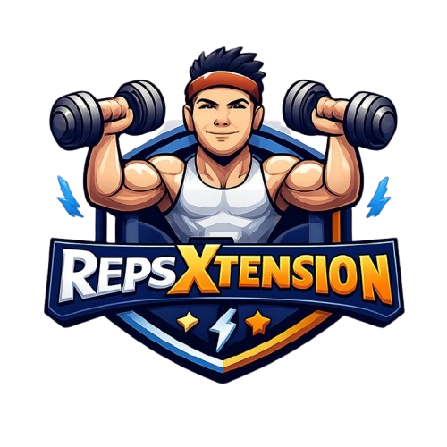

<div align="center">



# RepsXtension

### Micro workouts for remote workers

[](https://developer.chrome.com/docs/extensions/)
[](https://developer.chrome.com/docs/extensions/develop/migrate/what-is-mv3/)
[](https://react.dev/)
[](https://www.typescriptlang.org/)
[](https://tailwindcss.com/)

Break the scroll. Do a set. Get back to work.

[Quickstart](#-quickstart) • [Features](#-features) • [Development](#-development) • [Docs](#-docs) • [Privacy](#-privacy) • [License](#-license)

</div>

---

## ✨ What this is

RepsXtension is a **local-first Chrome extension** for tracking quick desk-friendly exercises (reps or timed holds) from a fast popup. It includes **progression + unlocks**, **streaks**, **achievements**, and **smart break reminders** while keeping your data in Chrome storage.

## 🚀 Quickstart

### Requirements

- Node.js (recommend 18+)
- npm (or yarn)

### Install (Chrome developer mode)

1. Build the extension:

```bash
npm install
npm run build
```

2. Load it in Chrome:

- Open `chrome://extensions/`
- Enable **Developer mode**
- Click **Load unpacked**
- Select the `dist` folder

## 🌟 Features

- **Fast logging**: one-click quick-add for reps or duration
- **Progression + unlocks**: unlock new exercises as you level up (registry-driven)
- **Streaks**: keep momentum with streak tracking and milestone celebrations
- **Achievements**: earn badges as you train consistently
- **Smart break reminders**: notifications powered by alarms + optional active-time tracking
- **Local-first storage**: workout history stays on-device (`chrome.storage.local`), settings can sync (`chrome.storage.sync`)
- **Light/dark theme**: clean UI that respects your preferences

### Exercises

The exercise list is **data-driven** and lives in `src/features/exercises/config/exercises.ts`.

- Starter examples: **Push-ups**, **Jumping Jacks**, **Neck Rolls**
- Unlocks include strength, cardio, stretches, and eye-care style drills

## 🛠 Development

### Commands

```bash
# Watch + rebuild into dist/
npm run dev

# Production build into dist/
npm run build

# Tests
npm test
npm run test:watch
npm run test:coverage

# Quality
npm run type-check
npm run lint
npm run lint:fix
```

### Local workflow

- Run `npm run dev`
- In `chrome://extensions/`, click **Reload** on the extension after each rebuild (Chrome doesn’t auto-reload unpacked extensions)

## 🧱 Tech stack

- **UI**: React + TypeScript + Tailwind + Radix primitives
- **Build**: Webpack 5 (outputs to `dist/`)
- **Extension**: Chrome Manifest V3 (popup + background service worker)
- **Storage**: `chrome.storage.local` (data) and `chrome.storage.sync` (settings)
- **Testing**: Jest + Testing Library

## 📚 Docs

- **Architecture**: `ARCHITECTURE.md`
- **Feature backlog**: `ROADMAP.md`
- **Auth/sync (future)**: `AUTH.md` (current builds are local-first with no login)

## 🔐 Privacy

- **No trackers**
- **No servers required**
- **Your workout data stays in your browser storage**

## 🤝 Contributing

PRs are welcome.

- If you’re adding or changing exercises, update the registry in `src/features/exercises/config/exercises.ts`
- If you’re changing storage or progression rules, please include tests when possible

## 📄 License

ISC License, see `LICENSE`.
